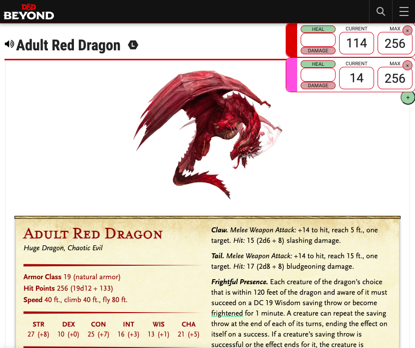
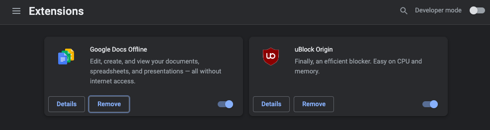
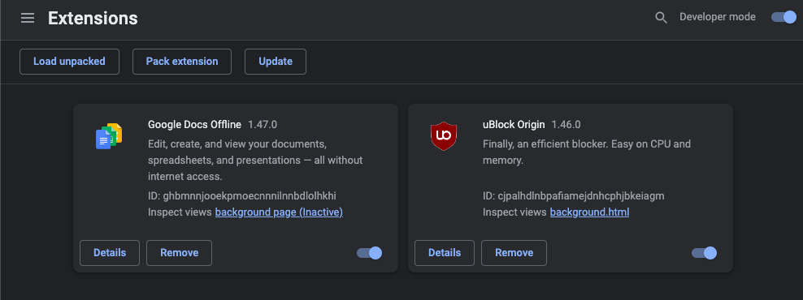
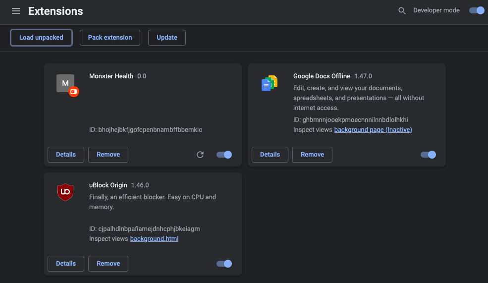

# DND Beyond Monster Health Tracker

## To Install

Go to the chrome web store listing here: https://chrome.google.com/webstore/detail/monster-health/gnodjanmafjgplabalghfobflnojbcoa

## Features

- Copycat interface for damage and healing that character sheets have

- Automatically reads the **Hit Points** field on the monster sheet to populate the current and max health

- Allows for multiple health bars for tracking multiple monsters of the same type

- All health bars data is stored in `localStorage` browser data, so health bars are preserved on tab close

- Input sanitization, to ensure only integers values are used

## Developer Installation

1. Navigate to `chrome://extensions` in your browser

2. Enable the **Developer mode** option in the top-right

3. Press the **Load unpacked** button in the top-left and select the `monster-health` directory in your clone of this repository

4. The extension should now show up in your list of installed extensions, view a monster sheet to see the extension in action!